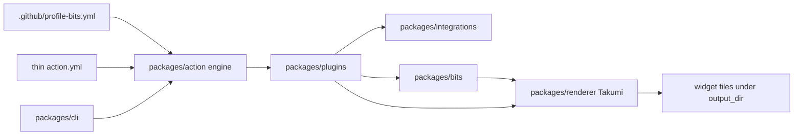
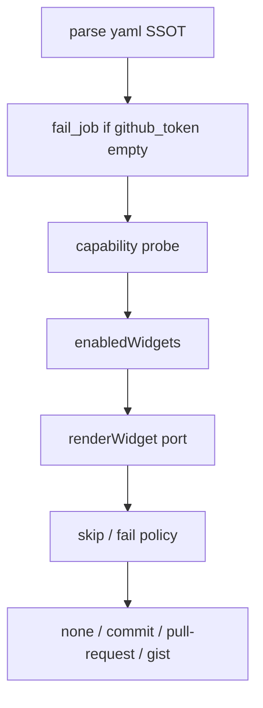

# profile-bits

GitHub profile README widgets that read as dense GitHub-native stats cards: Geist, Primer-adjacent neutrals, **480×160**, flat 1px borders, no shadows. Dark is default. Motion is Takumi authoring input, not GitHub SVG runtime. Delivery is the Action committing widget files. The docs playground is codegen plus layout preview, not a public embed API. Gist is an optional `output_action`, not a CDN. `/generate/catalog` is a first-party visual gallery, not a marketplace. Local CLI (`just render` / `packages/cli`) wraps Action `runMain`; CLI default `output_action` is `none`. Customize via yaml plus first-party `http` / `rss` / `chips`, not a user plugin loader.

## Overview

A **plugin** is a pack of widgets plus declared integrations (1..N widgets, 0..N integrations) — not a single card and not a single API. First-party packs are `github`, `wakatime`, `rss`, and `http`. Users never put `bits:` in yaml. Widgets consume cached integration payloads; they do not speak HTTP. `@profile-bits/renderer` is the only Takumi import site.

Default canvas is `theme: dark` (`CONFIG_THEME_DEFAULT`). Light is the named pair `light-*`, not a second product.

## Colors

Tokens are `THEME_TOKENS` in `packages/core/src/types.ts` and palettes in `packages/renderer/src/themes.ts`. Dark (`DARK_THEME`) is unprefixed; light (`LIGHT_THEME`) is `light-*`. `font` is Geist (typography), not a color.

| Token | Dark | Light |
| --- | --- | --- |
| `bg` | `#0d1117` | `#ffffff` |
| `card` | `#161b22` | `#f6f8fa` |
| `text` | `#e6edf3` | `#1f2328` |
| `muted` | `#8b949e` | `#59636e` |
| `accent` | `#58a6ff` | `#0969da` |
| `border` | `#30363d` | `#d0d7de` |

`Theme` fills `bg` and sets `text` + Geist. Github JSX cards sit on that canvas. `feed` / `json` / `coding` templates fill `card` and set `borderColor`. Compiled CSS vars: `--pb-bg`, `--pb-card`, `--pb-text`, `--pb-muted`, `--pb-accent`, `--pb-border`, `--pb-font`.

`accent` is the only emphasis fill (`Bar`). `muted` is secondary copy and empty states. Do not invent extra hues.

## Typography

Vendored Geist WOFF2 Latin **300–800** in `packages/renderer/fonts/` (`Geist-Light` … `Geist-ExtraBold`). `googleFonts()` is last-resort and forbidden in CI. One shared `Renderer` + `registerFont`. Family name is **Geist**.

Bits defaults (`packages/bits`):

| Role | Size | Weight | Color |
| --- | --- | --- | --- |
| `Text` | 14 | 600 | `text` |
| `Muted` | 12 | 400 | `muted` |
| `Stat` label | 10 | default | `muted` |
| `Stat` value | 16 | 700 | `text` |
| `Chip` | 11 | default | `text` |
| `Bar` label | 10 | default | `muted` |

Widget overrides stay local (demo title 20/600; json hostname 11/500). Empty copy uses `muted`, never a fake `0`.

## Layout

Card size is `CARD_WIDTH` × `CARD_HEIGHT` = **480×160** (`packages/core/src/types.ts` and `packages/renderer/src/fonts.ts`). Root Takumi node is `width: 100%`, `height: 100%`. Aspect 3:1.

`Frame` is a full-bleed column. `Stack` default gap **6**. `Row` default gap **8**, `align-items: center`. `output_dir` default `profile-bits`. `output_pair: true` writes `filename` plus `filename-dark`.

ICO is the size exception: **240×80** (Takumi ICO u8 cap; same 3:1). Still formats: png, jpeg, webp, ico. SVG is the default baked still. Animation formats: gif, apng, animated webp (`ANIMATION_FPS_DEFAULT` 5, `ANIMATION_DURATION_MS_DEFAULT` 400). APNG file extension is `.png`.

## Elevation & Depth

No shadows. Bits set no `boxShadow`. Depth is a **1px `border`** (Chip) or a 1px `Divider` in `border`. Cards are flat Primer surfaces, not Material elevation.

## Shapes

| Shape | Token | Source |
| --- | --- | --- |
| Bar track | radius 3 | `Bar.tsx` |
| Chip | radius 999 | `Chip.tsx` |
| Avatar | circle, default size 36 (`borderRadius: size / 2`) | `Avatar.tsx` |
| Frame / Theme | square full-bleed | no radius |

Do not mix pill chips with a second radius language on the same card.

## Components

v0 bits (`BIT_EXPORTS`): `Theme`, `Frame`, `Stack`, `Row`, `Text`, `Muted`, `Stat`, `Bar`, `Chip`, `Avatar`, `Divider`. Takumi-safe: `div` / `span` / `img` + `tw` / `style` / `className` only. No `react-dom`, `useEffect`, portals, or `document`.

| Bit | Contract |
| --- | --- |
| `Theme` | Default `dark`. Fills `bg`, sets Geist + `text`. |
| `Frame` | 100% × 100% column. |
| `Stack` | Column, gap 6. |
| `Row` | Row, gap 8, centered. |
| `Text` | 14 / 600 / `text`. |
| `Muted` | 12 / 400 / `muted`. |
| `Stat` | Label 10 muted; value 16 / 700. `0` and `false` render. |
| `Bar` | 6px track, radius 3, `border` track, `accent` fill, pct clamped 0–100. |
| `Chip` | Radius 999, font 11, pad 8×2, 1px `border`, `card` fill. |
| `Avatar` | Size 36, round. |
| `Divider` | 1px × 100% `border`. |

Empty copy (exact strings): **No language data** · **No coding data** · **No feed items** · **No data**. Never invent `0` for omitted include keys.

## Do's and Don'ts

- Do treat yaml `.github/profile-bits.yml` as config SSOT (`additionalProperties: false`).
- Do keep `action.yml` thin. Yaml beats `plugin_github`. No `plugin_<plugin>_<widget>_<option>` inputs.
- Do render default SVG as a baked still (outlined glyphs). No `<style>`, `@keyframes`, SMIL, or `foreignObject` in default SVG.
- Do pass CSS `@keyframes` into `render` / `renderAnimation` only — not GitHub SVG runtime.
- Do fail the job on empty / `""` / whitespace `github_token`. Never unauthenticated GitHub (60/h/IP).
- Do languages crawl: filter forks/archived **then** cap 500; GraphQL `nodes(ids:)` batches of 100. Never REST `/languages`.
- Don't put `bits:` in yaml. Don't import `takumi-js` / `@takumi-rs/*` from widgets or the Action.
- Don't invent first-party plugins beyond `github`, `wakatime`, `rss`, `http`.
- Don't patch consumer `README.md`. Don't tag `v1` at `main`. `dist/` is gitignored on `main`.
- Don't document `POST /api/preview` as an embed API. Don't treat gist as a CDN. Don't treat `/generate/catalog` as a plugin marketplace.

## Architecture

| Package | Owns |
| --- | --- |
| `core` | Types, yaml parse, auth policy, thin `action.yml` codegen |
| `integrations` | `static`, `github`, `wakatime`, `rss`, `http` clients |
| `plugins` | Packs + widget views (no HTTP) |
| `bits` | Shared Takumi UI |
| `renderer` | Only Takumi import site |
| `action` | Engine + git/gist ports |
| `cli` | `packages/cli` wraps action `runMain` |
| `apps/docs` | Fumadocs playground + codegen |

## Catalog

Live catalog is `packages/core/src/types.ts` (`FIRST_PARTY_*`, `WIDGET_INTEGRATIONS`, `INTEGRATION_AUTH`).

| Plugin | Widgets | Integration | Auth |
| --- | --- | --- | --- |
| `github` | `demo`, `stats`, `languages` | `static` / `github` | none / optional |
| `wakatime` | `coding` | `wakatime` | required |
| `rss` | `feed` | `rss` | none |
| `http` | `json`, `chips` | `http` | optional |

Pack defaults: github on with no widget list → `stats` + `languages` (`demo` opt-in). Wakatime on with no widget list → `coding`. `plugins.http: {}` is widget-less; `json` only when `widgets.json` is present (https `url`); `chips` only when `widgets.chips` is present (`preset` + `types`). Rss `feed` requires https `url`.

### Code vs archived spec vs in-flight

| Layer | What it says |
| --- | --- |
| Live types | Four packs, seven widgets, five integrations (table above). |
| Archived `openspec/specs/plugin-contract` | github-only v0 (`demo` / `stats` / `languages`). **Lag.** Follow live types. |
| `engine.ts` `EnabledWidget` | `demo` \| `stats` \| `languages` \| `coding` \| `feed` \| `json` \| `chips`. |
| `enabledWidgets` | Github widgets + wakatime `coding` + rss `feed` + http `json` / `chips`. |
| `main.ts` | `runEngine(loaded, { renderWidget, … })`. `renderWidget` is a required port. |
| On-disk adapters | `render-github.ts`, `render-wakatime.ts`, `render-feed.ts`, `render-http.ts`. `composeRenderWidgets` routes `json` \|\| `chips` → `adapters.json`; `feed` → rss; other ids → github dispatcher (`coding` included). |
| Playground | `/playground/github` (`PREVIEW_WIDGET_IDS`: `demo` / `stats` / `languages`). Fixtures-only `/playground/http` explorer. No `/playground/wakatime` or `/playground/rss`. |

Hex palettes SSOT is `packages/themes` (named flavors). Renderer `themes.ts` consumes that catalog; do not copy flavor hex into plugins or bits.

## Pipeline

`output_action`: `none` \| `commit` \| `pull-request` \| `gist`. Gist is SVG-only and requires `canGist`. `dry_run` and `none` never commit, open a PR, or update a gist. Action writes widget files only — it does **not** patch `README.md`. Default format `svg`. `ImageResponse` is docs-only (`takumi-js/response` on the playground route).

## Config vs Action

Yaml path default: `.github/profile-bits.yml`. Root fields: `version`, `format`, `theme`, `output_pair`, `animated`, `timezone`, `output_dir`, `plugins`. Widget options live in yaml.

Thin Action inputs (codegen SSOT): `user`, `github_token`, `committer_token`, `config`, `plugin_github`, `wakatime_token` (no default), `http_token_env` (env **name**, no default), optional `format` / `theme` / `output_pair` / `animated`, `output_action`, `committer_branch`, `committer_gist`, `output_condition`, `timezone`, `dry_run`, `allow_skipped`. `runs.using: node24`. `main: dist/index.js`. `engine.ts` never reads `wakatime_token` or `http_token_env` (`decideWakatimeToken` / `decideHttpTokenEnv` have no Action callers).

Yaml present (including empty string) beats `plugin_github`. `plugin_github: true` applies github pack defaults only when the config file is absent. No `plugin_wakatime` / `plugin_rss` / `plugin_http` bools.

> [!IMPORTANT]
> Never flattened `plugin_<plugin>_<widget>_<option>` Marketplace inputs. `generate-action --check` rejects them.

## Auth and fetch

> [!IMPORTANT]
> Never unauthenticated GitHub. Empty / `""` / whitespace `github_token` fails the job.

> [!WARNING]
> Languages: REST crawl, **filter forks/archived then cap 500**, GraphQL `nodes(ids:)` batches of 100. Never REST `/languages`. Never 500 per-repo GraphQL calls.

Github: one client per run; REST `GET /users/{login}` + paginated `/repos?type=owner&per_page=100`. Stars and language bytes share that ordered id list. GraphQL HTTP 200 + `errors[]` / remaining 0 = fail-after-backoff. `include_private` without `canPrivate` fails the widget. Contributions GraphQL only if `canContributions`.

Wakatime: `auth: required`. RFC Basic `base64(api_key + ":")`. Never `?api_key=` or Bearer for the API key. Missing `wakatime_token` fails the job **only when the pack is on**. Hostname `wakatime.com` → Cloud stats path; other allowed hosts → Wakapi compat path.

Rss: `auth: none`; https GET; playground uses XML fixtures, zero live feeds.

Http: `auth: optional`. Unset `http_token_env` sends no Authorization. Named env empty → `fail_widget`. SSRF closed. 1 MiB body cap.

## Playground

Routes: `/playground` → `/playground/github`. Fixtures-only `/playground/http` explorer exists (`json` / `chips`; do not add those ids to `PREVIEW_WIDGET_IDS`). No `/playground/wakatime` or `/playground/rss`. GitHub preview widgets stay `demo`, `stats`, `languages`.

`POST /api/preview` is a docs layout/time-axis preview, not a stable embed API. Dual pane: WASM layout + README mode (`renderSvg` / `renderAnimation`). No App token → fixtures, zero outbound GitHub. Wakatime / rss / http preview: fixtures only. `PREVIEW_TOKEN_QUERY_KEYS` includes `github_token`, `wakatime_token`, `http_token_env`, `http_token` so permalinks cannot round-trip secrets. `Cache-Control: no-store`.

## Authoring

Canonical plugin: `.agents/profile-bits/` (`plugin.json`, exactly six skills). Install is a documented human command, not an agent step: `npx skills add ./.agents/profile-bits`. MUST NOT pass `--all`. MUST NOT create `.claude/`. Agents MUST NOT run `skills add` in this repo. Skills: `author` (read-only router; ideate is a mode), `author-bit`, `author-palette`, `author-integration`, `author-widget`, and `author-plugin`. `Theme` the bit and in-card `Chip` route to `author-bit`; root yaml `theme`, named flavors, and seven-token palettes route to `author-palette`; Shields.io README images stay in sibling README tooling. No `author-theme`, `author-badge`, or seventh skill. Catalog SSOT is live `packages/core/src/types.ts` — today’s packs (`github`, `wakatime`, `rss`, `http`) are a snapshot, not a frozen table the Agent Plugin must bump. Skills follow live `FIRST_PARTY_*`; a new pack is OpenSpec-first, then types, then skills. Completing an id already in `FIRST_PARTY_*` is allowed. **Adding a new id requires OpenSpec first.**

## Document map

| Doc | Role |
| --- | --- |
| `DESIGN.md` | Visual tokens + honest runtime (this file) |
| `AGENTS.md` | Agent locks; nested package `AGENTS.md` per tree |
| `packages/core/src/types.ts` | Catalog SSOT |
| `packages/themes` | Named-theme hex SSOT |
| `packages/renderer/src/themes.ts` | Resolved palettes for Takumi |
| `packages/bits/src/*` | Bit metrics |
| `packages/action/src/engine.ts` | `EnabledWidget` / `enabledWidgets` |
| `openspec/specs/` | Archived contract after sync (may lag types) |
| `openspec/changes/<id>/` | In-flight unit of work |
| `.agents/profile-bits/` | Authoring skills SSOT |
