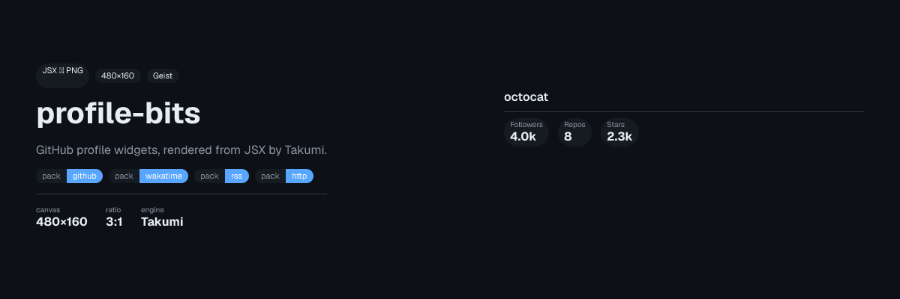
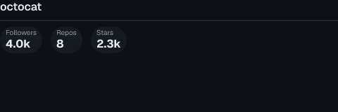
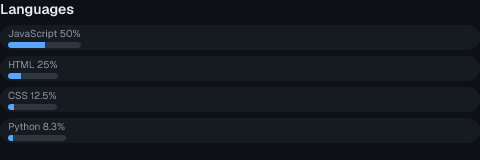
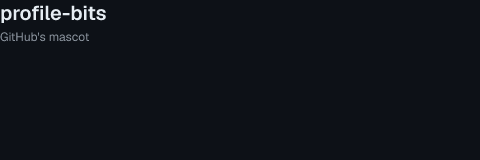
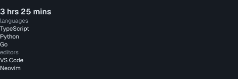
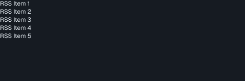
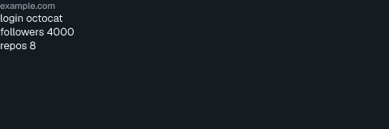
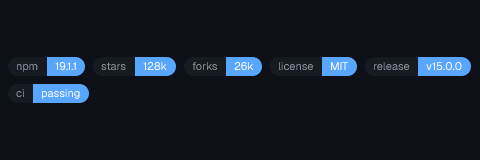
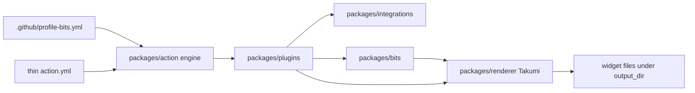

<div align="center">

# profile-bits

GitHub profile README widgets as dense GitHub-native stats cards. JSX in, PNG/SVG out — Takumi skips the browser.

<picture>
  <source media="(prefers-color-scheme: light)" srcset="docs/assets/readme/hero-light.png">
  
</picture>

</div>

<!-- BADGES:START -->
<!-- generated by add-badges 2026-08-18 -->

<p align="center">
  <a href="https://github.com/wyattowalsh/profile-bits/actions/workflows/ci.yml"></a>
</p>

<p align="center">
  <a href="https://github.com/wyattowalsh/profile-bits/blob/main/LICENSE"></a>
</p>

<p align="center">
  <a href="https://nodejs.org/"></a>
  <a href="https://pnpm.io/"></a>
  <a href="https://www.typescriptlang.org/"></a>
  <a href="https://takumi.kane.tw/"></a>
  <a href="https://openspec.dev/"></a>
  <a href="https://vitest.dev/"></a>
  <a href="https://biomejs.dev/"></a>
  <a href="https://docs.github.com/actions"></a>
</p>

<p align="center">
  <a href="https://github.com/wyattowalsh/profile-bits/stargazers"></a>
  <a href="https://github.com/wyattowalsh/profile-bits/graphs/contributors"></a>
</p>

<!-- BADGES:END -->

A **plugin** is a pack of widgets plus declared integrations (1..N widgets, 0..N integrations) — not a single card and not a single API. First-party packs: `github`, `wakatime`, `rss`, `http`. Cards are [Takumi](https://takumi.kane.tw/)-rendered **480×160** stills (Geist, 1px borders, dark default).

README delivery is the **Action committing widget files**. You paste relative `` embeds. The Action does **not** patch `README.md`.

> [!NOTE]
> There is **no public embed API**. The docs playground is layout preview plus YAML/markdown codegen. `/generate/catalog` is a first-party visual gallery, not a marketplace. Gist is an optional `output_action`, not a CDN.

## Widgets

Fixture-rendered samples (octocat / WakaTime / RSS / HTTP fixtures — no live tokens). Click a card for Action usage.

<p align="center">
  <a href="#quick-start"></a>
  <a href="#quick-start"></a>
  <a href="#quick-start"></a>
  <a href="#quick-start"></a>
  <a href="#quick-start"></a>
  <a href="#quick-start"></a>
  <a href="#quick-start"></a>
</p>

Light-theme pair: `docs/assets/readme/*-light.png`.

## Quick start

Config SSOT is committed `.github/profile-bits.yml` (`additionalProperties: false`). Widget options live there. Thin Action `with:` keys only.

> [!IMPORTANT]
> Yaml is the option SSOT. There are **no** flattened `plugin_<plugin>_<widget>_<option>` Action inputs and **no** `plugin_wakatime` / `plugin_rss` / `plugin_http` bools. Yaml present (including an empty file) beats `plugin_github`.

> [!WARNING]
> Never unauthenticated GitHub. Empty / `""` / whitespace `github_token` **fails the job**. Omit the input to use `${{ github.token }}`; do not pass an empty secret.

```yaml
name: Profile Bits
on:
  schedule:
    - cron: "0 0 * * *"
  workflow_dispatch:
permissions:
  contents: write
jobs:
  profile-bits:
    runs-on: ubuntu-latest
    steps:
      - uses: actions/checkout@v4
      - uses: wyattowalsh/profile-bits@v1
        with:
          user: ${{ github.repository_owner }}
          github_token: ${{ github.token }}
          committer_token: ${{ github.token }}
          config: .github/profile-bits.yml
          output_action: commit
```

Pin a **published orphan release tag** (`@v1` when that tag exists). Never pin `main` — `dist/` is gitignored on `main`; the Action bundle lives on the orphan `release/v1` tree. Runtime is Node 24 (`runs.using: node24`).

After the Action commits files, embed relatives that match `output_dir` + widget `filename` + format (default `profile-bits/` + `svg`):

```md


```

With `output_pair: false` (default), `stats.svg` is the **dark** card. With `output_pair: true`, the unsuffixed file is **light** and `filename-dark` is dark — pair embeds should use `<picture>` (same pattern as the hero above), not a lone `stats.svg`.

<details>
<summary>Default <code>.github/profile-bits.yml</code> (github <code>stats</code> + <code>languages</code>)</summary>

```yaml
version: 1
format: svg
theme: dark
output_pair: false
animated: false
timezone: UTC
output_dir: profile-bits
plugins:
  github:
    widgets:
      stats:
        filename: stats
        include: [followers, repos, stars]
        hide_rank: true
        avatar: true
        animate: false
        include_private: false
        include_forks: false
        include_archived: false
      languages:
        filename: languages
        limit: 8
        min_pct: 1
        exclude: []
        animate: false
        include_private: false
        include_forks: false
        include_archived: false
```

Unknown keys fail parse. Github on with no widget list defaults to `stats` + `languages`; `demo` is opt-in.

</details>

<details>
<summary>Optional packs — <code>wakatime</code> / <code>rss</code> / <code>http</code> (real keys only)</summary>

Additive under `plugins`. Do not invent a fifth pack or a user plugin loader.

```yaml
plugins:
  wakatime: {}
  rss:
    widgets:
      feed:
        filename: feed
        url: https://example.com/feed.xml
  http:
    widgets:
      json:
        filename: json
        url: https://example.com/stats.json
      chips:
        filename: chips
        preset: shieldcn
        types: [stars, license]
        repo: example/repo
```

| Pack | Enablement | Secrets |
| --- | --- | --- |
| `wakatime` | Empty `plugins.wakatime: {}` enables default widget `coding`. | `wakatime_token` (no default). Required only when the pack is on. Workflow: `${{ secrets.WAKATIME_TOKEN }}`. Env: `WAKATIME_TOKEN`. |
| `rss` | `widgets.feed.url` required (`https`). | none |
| `http` | `plugins.http: {}` is **widget-less**. `json` needs https `url`. `chips` needs `preset` + `types` (no `url` / `headers` / `bits` on chips). | Optional `http_token_env` is an **environment variable name**, not a token. Unset sends no `Authorization`. |

Never paste token literals into yaml, README, or workflow `with:`.

</details>

<details>
<summary>Thin Action inputs (full <code>action.yml</code>)</summary>

Marketplace default `output_action` is **`commit`**.

| Input | Role |
| --- | --- |
| `user` | GitHub login. Default `${{ github.repository_owner }}`. |
| `github_token` | API token. Omitted → workflow token. Empty / whitespace **fails**. |
| `committer_token` | Commit / pull-request / gist. Default workflow token. |
| `config` | Yaml path. Default `.github/profile-bits.yml`. |
| `plugin_github` | Enable github pack (`stats`, `languages`) **only when the config file is absent**. Ignored when yaml exists. |
| `wakatime_token` | WakaTime API key. **No default.** Required when `plugins.wakatime` is on. |
| `http_token_env` | **Name** of the env var holding an optional HTTP Bearer token. **No default.** |
| `format` | Optional override: `svg`, `png`, `jpeg`, `webp`, `ico`, `gif`, `apng`. |
| `theme` | Optional named theme id. `theme: custom` as an Action input fails. |
| `output_pair` | Optional. Write `filename` and `filename-dark`. |
| `animated` | Optional animated output override. |
| `output_action` | `none` \| `commit` \| `pull-request` \| `gist`. Default `commit`. Gist is SVG-only. |
| `committer_branch` | Branch to commit to. Default current branch. |
| `committer_gist` | Gist id when `output_action` is `gist`. |
| `output_condition` | `always` or `data-changed`. |
| `timezone` | Optional IANA name (for example `UTC`). |
| `dry_run` | Render without commit / PR / gist. |
| `allow_skipped` | When `true`, the job may succeed if every github widget is skipped. Default `false`. |

`github_token` is still required on http-only / wakatime-only yaml. Local env fallback is `GITHUB_TOKEN` then `GH_TOKEN`.

</details>

## Local CLI

Same engine as the Action (`packages/cli` wraps `runMain`). CLI default `output_action` is **`none`** (write files under yaml `output_dir`; do not commit, open a PR, or update a gist unless asked). Marketplace default remains `commit`.

```bash
just render
pnpm render
profile-bits render
```

Agent / CI (JSON on stdout, no prompts, quiet stderr). `--json` stdout is `{ files, skipped, did_commit }`. Tokens never appear in stdout, stderr, JSON, yaml, README, or command logs.

```bash
just render -- --json --no-input --quiet
pnpm render -- --json --no-input --quiet
```

`--output-action` values: `none` \| `commit` \| `pull-request` \| `gist`. Gist only when requested:

```bash
just render -- --output-action gist
```

## Plugin map

Live catalog: [`packages/core/src/types.ts`](packages/core/src/types.ts) (`FIRST_PARTY_*`). Do not invent extra first-party packs.

| Plugin | Widgets | Integration | Auth |
| --- | --- | --- | --- |
| `github` | `demo`, `stats`, `languages` | `static` / `github` | none / optional |
| `wakatime` | `coding` | `wakatime` | required |
| `rss` | `feed` | `rss` | none |
| `http` | `json`, `chips` | `http` | optional |

- Github pack defaults (no widget list): `stats` + `languages`. `demo` is opt-in.
- Wakatime pack defaults: `coding`.
- `plugins.http: {}` enables no widgets.

## Architecture

Yaml + thin Action inputs feed `packages/action`. Plugins consume cached integration payloads (widgets do not speak HTTP). `@profile-bits/renderer` is the only Takumi import site. Output is widget files under `output_dir`.



Visual identity: [DESIGN.md](DESIGN.md). Requirement contracts: [openspec/specs/](openspec/specs/).

## Docs

Public docs framework is the Next.js **Fumadocs** app in [`apps/docs`](apps/docs) (not a second docs site). No public deploy URL is recorded in this repo — run it locally:

```bash
just docs-dev
```

| Surface | Path | What it is |
| --- | --- | --- |
| Usage notes | `/docs` | Github pack notes |
| Playground | `/playground` | Layout preview + YAML/markdown codegen — **not** an embed API |
| Catalog | `/generate/catalog` | First-party visual gallery — **not** a marketplace |
| Agent stub | [`apps/docs/public/llms.txt`](apps/docs/public/llms.txt) | Pack/widget ids + config locks |

## Develop

Node **24**, pnpm workspace + **catalog:** SSOT, OpenSpec **1.9.0**, Takumi **2.9.2**, Vitest **4**, Biome **2.5**.

```bash
just install
just lint
just test
just docs
just generate-action          # pass --check in CI
just generate-docs            # pass --check in CI
just check
just openspec <args>
just render                   # local CLI (`profile-bits render`)
```

Also: `just docs-dev`. Nested package instructions: `packages/*/AGENTS.md`, `apps/docs/AGENTS.md`. OpenSpec engine JSON is a **subcommand flag** (`just openspec status --change <id> --json`), never `openspec --json`.

## License

[MIT](LICENSE) © 2026 Wyatt
