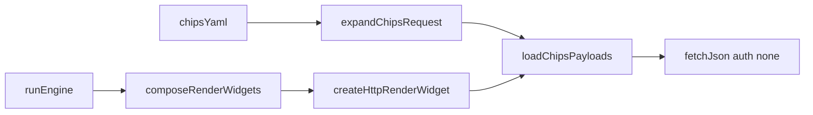
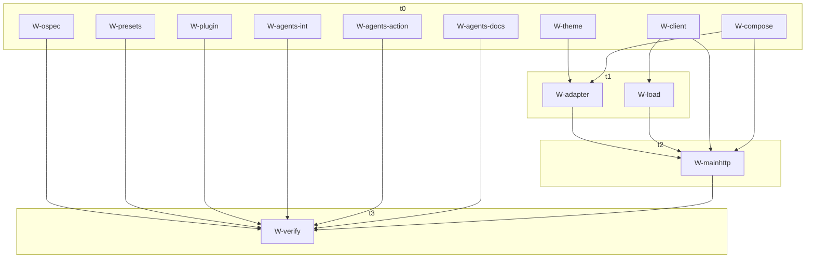

## Context

See `proposal.md` Why. Pack `http`, widgets `json` and `chips`, integration `http`, `createHttpClient`, and `runMain` json injection already exist. `enabledWidgets` already enumerates chips. Production still misses a complete chips Action path: `createHttpRenderWidget` throws `UnhandledHttpWidgetError` before a chips branch, and compose fallthrough historically sent chips to the github dispatcher (`UnhandledActionWidgetError`). `runEngine` has no try/catch around `render()`, so those throws skip `writeFiles` and drop pending json/github blobs.

Playground http already exists. This is not a greenfield chips feature. Do **not** reopen `add-http-json-integration` or uncheck `add-http-chips-widget`. Do **not** edit `openspec/specs/**`.

Constraints: Node 24, pnpm catalog, OpenSpec 1.9.0, Takumi 2.9.2 via `@profile-bits/renderer` only, Vitest 4, Biome 2.5. Thin `action.yml`. No flattened `plugin_http_*` inputs. Widgets perform no HTTP. Zero live network in tests. Exclusive planning glob: `openspec/changes/fix-http-chips-findings/**`.

Shared forbidden for apply: `main.ts`, `render.ts`, `engine.ts`, `ssrf.ts`, `types.ts`, `action.yml`, lockfile, `openspec/changes/add-http-json-integration/**`, `openspec/changes/add-http-chips-widget/**`, `DESIGN.md`, `INTEGRATION_AUTH.http`.

## Goals / Non-Goals

**Goals:**

- Route chips through existing `adapters.json` and render chips in `createHttpRenderWidget` **before** `jsonOptions`.
- Write chips files as `filename.format` only (no adapter `-dark`).
- Forward `request.theme` into chips SVG.
- Per-request `auth: "none"` on chips GETs (skip missing throw, omit Bearer, cache key `"none"`).
- Keep pack `INTEGRATION_AUTH.http` `"optional"` so json still uses `http_token_env`.
- Exact expander path identity (`url.pathname === pathname`) plus `forbidden_path`.
- Catch `ChipsWidgetError` → `fail_widget` so mixed json+chips does not drop writes.

**Non-Goals:**

- Editing `packages/action/src/main.ts` (json is already injected).
- Renaming `adapters.json` or adding a `chips:` compose key.
- Setting `INTEGRATION_AUTH.http = none`.
- Catching renderer throws in `engine.ts`.
- Putting http ids in `render.ts`.
- Host-allowlist-only expander checks, prefix identity (`startsWith("/npm")`), or rejecting dots inside names (`next.js`, `ci.yml`).
- `redirect: "error"` as the only token fix.
- Mixed github stats + chips via `runMain` (no github fetch seam on `RunMainOptions`).
- Live playground fetches, `url=` chips yaml, restyling chips onto bits `Row`, OpenSpec archive/sync, `DESIGN.md`.

## Decisions

### 1. Compose reuses `adapters.json`; adapter branches chips before `jsonOptions`

- **Choice:** `composeRenderWidgets`: `id === "json" || id === "chips"` → existing `adapters.json`. `createHttpRenderWidget`: chips branch **before** `jsonOptions`. `chipsOptions`: `id === "chips"` and `"preset" in options`. Call `renderChipsFromClient(client, options, { user: request.inputs.user ?? "", theme: request.theme })` — pass **`request.theme`**, not `resolveWidgetTheme`. Files: `{ path: \`${options.filename}.${request.config.format}\`, contents: svg }` — **no** `-dark`. Catch **`ChipsWidgetError` → `fail_widget`**. Json catch stays `JsonWidgetError || HttpClientError`. Unknown id still `UnhandledHttpWidgetError`. If compose is fixed without the chips branch, the error becomes `UnhandledHttpWidgetError` and **still escapes**.
- **Why:** Json is already injected in `runMain`. Chips is missing from compose + the http adapter, not from the Action entrypoint. Renaming `adapters.json` would force `main.ts`.
- **Alternative:** `chips:` compose key / second `createHttpClient` — rejected (`main.ts`). Alternative: http ids in `render.ts` — rejected. Alternative: catch renderer throws in `engine.ts` — rejected; fix the dispatcher path.



### 2. Filename is `filename.format` only

- **Choice:** Adapter writes one path `${options.filename}.${request.config.format}`. Do not append `-dark` here. Paired dark files stay an engine/`output_pair` concern, not the http adapter.
- **Why:** Json adapter already uses this shape. Chips must match so `output_pair: true` does not emit a bogus `chips-dark.svg` from the adapter while both blobs are still dark from the dropped theme.
- **Alternative:** Adapter emits `-dark` — rejected.

### 3. Per-request `auth: "none"`; pack auth stays optional

- **Choice:** `HttpJsonRequest.auth?: "none"`. Required `fetchJson` order:

```ts
if (request.auth === "none") {
  // skip missing throw; authorization: undefined; cache auth: "none"
} else if (authorization.kind === "missing") {
  throw missing http token
}
// json omits auth → existing throw + Bearer unchanged
```

Cache and `Authorization` are **per request**, not the `createHttpClient` closure. `loadChipsPayloads` always passes `{ url, timeout_ms, auth: "none" }` and **no** `headers`. Json omits `auth`. Keep `wrapFailWidget` client-secret redact. Pack `INTEGRATION_AUTH.http` stays `"optional"`.

- **Why:** F2.http without F2.load activates the leak: wiring compose without `auth: "none"` on chips GETs starts CDN fetches with the json token. Pack auth `none` would break json `http_token_env`. Skipping only the missing-token throw still leaks Bearer (client-level authorization + cache `auth`).
- **Alternative:** `INTEGRATION_AUTH.http = none` — rejected. Alternative: `redirect: "error"` only — rejected; hops reuse one headers object. Alternative: second client — rejected (`main.ts`).

### 4. Exact path identity; `forbidden_path`; SSRF unchanged

- **Choice:** Whole-segment `""` / `.` / `..` on package, owner, repo name (exact `.`/`..` workflow). Keep `@scope/name` (1 segment or 2 with first `@[^/]+`). After `new URL(pathname, origin)`: **`url.pathname === pathname`** (the pre-resolution constructed path — exact equality, not a prefix). Empty search/hash. Origin still allowlisted. Deny-prefix is belt-only (`/badge`, `/endpoint`, `/https/`, `/memo`, `/discord`, `/reddit`, `/nba`, `/views`, `/watchers`) — it misses `foo/../bar` → `/npm/bar.json` without identity. New code `forbidden_path` on `ChipsExpandErrorCode` in **`presets.ts`**, not `types.ts`. Do not overload `forbidden_origin`. Do not edit `ssrf.ts`.
- **Why:** `encodeURIComponent("..") === ".."` then `new URL()` walks off `/npm` and `/github`. Prefix identity (`startsWith("/github")`) accepts `/github/watchers.json` after `stars/../watchers`.
- **Alternative:** Host allowlist only — rejected. Alternative: reject dots inside names — rejected (`next.js`, `ci.yml`). Alternative: slash-count that breaks `@scope/name` — rejected.

### 5. MUST NOT edit `main.ts`

- **Choice:** Production `runMain` already constructs one `createHttpClient({ token })` and injects `composeRenderWidgets({ json: createHttpRenderWidget({ client }), ... })`. This change MUST NOT edit `main.ts`. Prove chips-only and json+chips http-only via `main-http.test.ts`. Prove mixed json-then-chips-404 does not drop json writes with **`runEngine` + real `composeRenderWidgets` + stub github** in `render-http.test.ts`. Do **not** add mixed github stats via `runMain` (`RunMainOptions` has `httpFetch` only; mixed github would hit live Octokit).
- **Why:** Json is already injected. Editing `main.ts` fights exclusive ownership and is unnecessary once compose + adapter handle chips.
- **Alternative:** Wire a `chips:` key in `main.ts` — rejected.

### 6. Exclusive apply graph (writer-start vs merge)

- **Choice:** One writer per exclusive glob. Writer-start and merge are different constraints.

```text
t0  W-ospec ∥ W-presets ∥ W-client ∥ W-theme ∥ W-plugin
    ∥ W-agents-int ∥ W-agents-action ∥ W-agents-docs ∥ W-compose

t1  W-load    after W-client
    W-adapter after W-theme ∧ W-compose
    (load ∥ adapter)

t2  W-mainhttp after W-adapter ∧ W-compose ∧ W-load ∧ W-client

t3  just lint && just test && just generate-action --check
```

- **Writer start:** W-adapter starts after **W-theme ∧ W-compose** only (not presets or load). W-load starts after **W-client**.
- **Merge/ship:** MUST NOT land compose+adapter without load passing `auth: "none"` (activation of the CDN Bearer leak). Atomic unit: **W-client + W-load + W-compose + W-adapter + W-mainhttp**.
- **Cross-plan `client.ts`:** `http_client_findings` also owns `client.ts`. Do not steal that glob. If both execute: HTTP client stitch first, then chips `auth: "none"` on the stitched client. If chips lands first: HTTP client hop-loop MUST keep the `request.auth === "none"` branch.
- **Why:** False joins (adapter gated on presets+load) serialized work. Theme + compose are the real type/join gates for the adapter.
- **Alternative:** Serialize all apply behind OpenSpec F0 — rejected; propose is artifacts-only then STOP for W-ospec only. Alternative: two writers on `render-http.ts` / `client.ts` / `presets.ts` — rejected.



### 7. bitsUsed and AGENTS one-liners

- **Choice:** `HTTP_BITS_USED = ["Theme","Frame","Muted","Chip"]`. Json uses zero bits; chips uses a wrapping `div`, not `Row`. Do not restyle onto `Row`. Integrations AGENTS: drop “Do not add `/playground/http` UI in this change”; **keep** fixtures-only / zero live URLs. Action Ports: compose joins json **and** chips (enablement section already names chips). Docs AGENTS: drop “in this change” on rss-no-route. No `DESIGN.md`.
- **Why:** Pack metadata was left on Stack/Row/Text after chips shipped Chip chrome. Playground http already exists.
- **Alternative:** Fan-out three OpenSpec spec writers — rejected (one change folder). Alternative: restyle chips onto `Row` — rejected.

## Risks / Trade-offs

- [Compose without `auth: "none"` on load] → CDN GETs inherit json Bearer. Mitigation: merge unit is client + load + compose + adapter + mainhttp. Do not ship compose+adapter without load.
- [Adapter without chips branch] → `UnhandledHttpWidgetError` still escapes `runEngine` and drops pending writes. Mitigation: chips **before** `jsonOptions`; catch `ChipsWidgetError`.
- [Prefix path identity] → `stars/../watchers` becomes `/github/watchers.json`. Mitigation: exact `url.pathname === pathname` plus whole-segment `.`/`..`.
- [Pack auth `none`] → json `http_token_env` breaks. Mitigation: pack stays `optional`; per-request `auth: "none"` only.
- [Theme dropped] → `output_pair: true` writes two dark files. Mitigation: pass `request.theme`.
- [Two writers on `client.ts`] → queue chips W-client behind http_client_findings stitch.
- [Mixed github via `runMain`] → live Octokit. Mitigation: http-only `runMain`; mixed no-throw via `runEngine` + stub github.
- [Stealing forbidden globs] → exclusive ownership table; queue, never steal.

## Migration Plan

Additive behavior on existing pack `http` / widget `chips`. Default committed yaml stays github-only. Existing json yaml keeps Bearer. Existing chips yaml starts writing `chips.svg` once compose + adapter land **with** load `auth: "none"`. Rollback: omit `plugins.http.widgets.chips`; revert this change folder before archive. Do not archive or commit unless asked.

## Open Questions

(none — chips-before-`jsonOptions`, `filename.format` only, per-request `auth: "none"`, pack `INTEGRATION_AUTH.http` optional, and MUST NOT edit `main.ts` are locked above)
